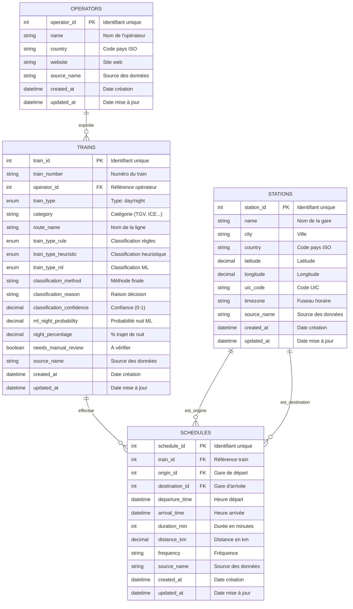
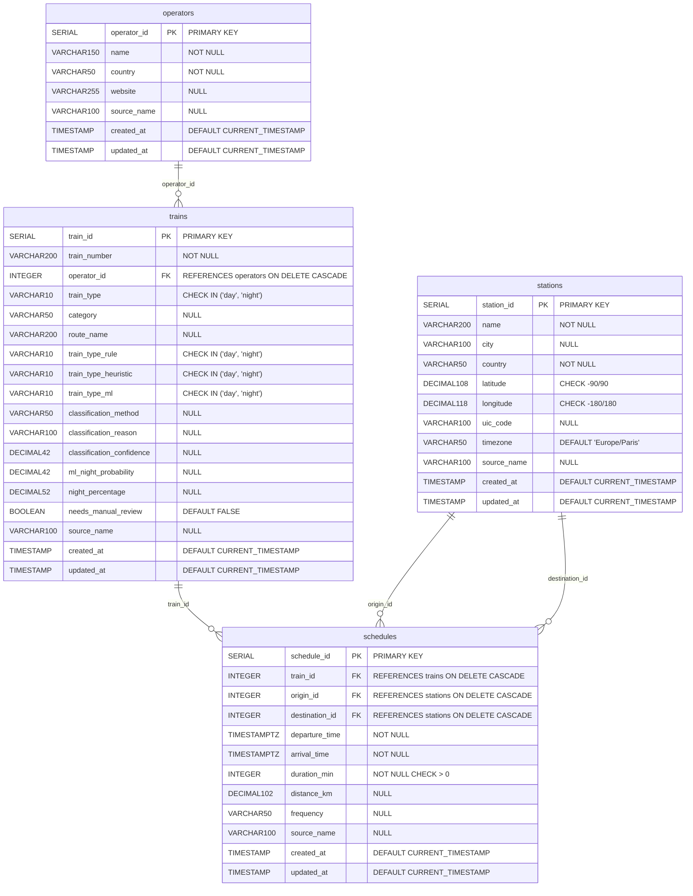

# Diagrammes de la Base de Données OBRail Europe

## Modèle Conceptuel de Données (MCD)

---

## Modèle Physique de Données (MPD) - PostgreSQL

---

## Contraintes et Indexes

### Contraintes d'unicité (UNIQUE)

| Table | Colonnes | Description |
|-------|----------|-------------|
| operators | (name, country, source_name) | Opérateur unique par source |
| stations | (name, country, source_name) | Gare unique par source |
| trains | (train_number, operator_id, source_name) | Train unique par opérateur/source |
| schedules | (train_id, origin_id, destination_id, departure_time) | Desserte unique |

### Contraintes CHECK

| Table | Contrainte | Description |
|-------|------------|-------------|
| stations | latitude BETWEEN -90 AND 90 | Validité coordonnées |
| stations | longitude BETWEEN -180 AND 180 | Validité coordonnées |
| trains | train_type IN ('day', 'night') | Type de train valide |
| trains | train_type_rule IN ('day', 'night') | Classification règle valide |
| trains | train_type_heuristic IN ('day', 'night') | Classification heuristique valide |
| trains | train_type_ml IN ('day', 'night') | Classification ML valide |
| schedules | origin_id != destination_id | Gares différentes |
| schedules | duration_min > 0 | Durée positive |
| schedules | arrival_time > departure_time | Arrivée après départ |

### Indexes

| Table | Index | Colonne(s) | Usage |
|-------|-------|------------|-------|
| operators | idx_operators_country | country | Filtrage par pays |
| operators | idx_operators_source | source_name | Filtrage par source |
| operators | idx_operators_name | name | Recherche par nom |
| stations | idx_stations_country | country | Filtrage par pays |
| stations | idx_stations_city | city | Filtrage par ville |
| stations | idx_stations_uic | uic_code | Recherche UIC |
| stations | idx_stations_coordinates | latitude, longitude | Requêtes géo |
| stations | idx_stations_name | name | Recherche par nom |
| trains | idx_trains_operator | operator_id | Jointure opérateur |
| trains | idx_trains_type | train_type | Filtrage type |
| trains | idx_trains_category | category | Filtrage catégorie |
| trains | idx_trains_number | train_number | Recherche numéro |
| schedules | idx_schedules_train | train_id | Jointure train |
| schedules | idx_schedules_origin | origin_id | Jointure origine |
| schedules | idx_schedules_destination | destination_id | Jointure destination |
| schedules | idx_schedules_departure | departure_time | Filtrage date/heure |
| schedules | idx_schedules_route | origin_id, destination_id | Recherche trajet |

---

## Dictionnaire de Données

### Table `operators`

| Attribut | Type | Description | Exemple |
|----------|------|-------------|---------|
| operator_id | SERIAL | Identifiant auto-incrémenté | 1 |
| name | VARCHAR(150) | Nom de l'opérateur | SNCF |
| country | VARCHAR(50) | Code pays ISO 3166-1 alpha-2 | FR |
| website | VARCHAR(255) | URL du site web | https://www.sncf.com |
| source_name | VARCHAR(100) | Source des données | transport.data.gouv |
| created_at | TIMESTAMP | Date de création | 2025-01-15 10:30:00 |
| updated_at | TIMESTAMP | Date de dernière modification | 2025-01-15 10:30:00 |

### Table `stations`

| Attribut | Type | Description | Exemple |
|----------|------|-------------|---------|
| station_id | SERIAL | Identifiant auto-incrémenté | 1 |
| name | VARCHAR(200) | Nom de la gare | Paris Gare de Lyon |
| city | VARCHAR(100) | Ville de la gare | Paris |
| country | VARCHAR(50) | Code pays ISO 3166-1 alpha-2 | FR |
| latitude | DECIMAL(10,8) | Latitude en degrés décimaux | 48.84480000 |
| longitude | DECIMAL(11,8) | Longitude en degrés décimaux | 2.37350000 |
| uic_code | VARCHAR(100) | Code UIC international | 8768600 |
| timezone | VARCHAR(50) | Fuseau horaire | Europe/Paris |
| source_name | VARCHAR(100) | Source des données | transport.data.gouv |
| created_at | TIMESTAMP | Date de création | 2025-01-15 10:30:00 |
| updated_at | TIMESTAMP | Date de dernière modification | 2025-01-15 10:30:00 |

### Table `trains`

| Attribut | Type | Description | Exemple |
|----------|------|-------------|---------|
| train_id | SERIAL | Identifiant auto-incrémenté | 1 |
| train_number | VARCHAR(200) | Numéro du train | TGV 1234 |
| operator_id | INTEGER | Clé étrangère vers operators | 1 |
| train_type | VARCHAR(10) | Type: day (06h-21h59) ou night (22h-05h59) | day |
| category | VARCHAR(50) | Catégorie du train | TGV |
| route_name | VARCHAR(200) | Nom de la ligne | Paris - Lyon |
| train_type_rule | VARCHAR(10) | Classification issue des règles métier | night |
| train_type_heuristic | VARCHAR(10) | Classification issue de l'heuristique | day |
| train_type_ml | VARCHAR(10) | Suggestion du modèle ML | night |
| classification_method | VARCHAR(50) | Méthode finale retenue | rule |
| classification_reason | VARCHAR(100) | Raison de la décision | Back-on-Track night train list |
| classification_confidence | DECIMAL(4,2) | Niveau de confiance (0-1) | 0.95 |
| ml_night_probability | DECIMAL(4,2) | Probabilité ML classe night | 0.85 |
| night_percentage | DECIMAL(5,2) | % du trajet en période nocturne | 75.00 |
| needs_manual_review | BOOLEAN | Contrôle manuel recommandé | FALSE |
| source_name | VARCHAR(100) | Source des données | transport.data.gouv |
| created_at | TIMESTAMP | Date de création | 2025-01-15 10:30:00 |
| updated_at | TIMESTAMP | Date de dernière modification | 2025-01-15 10:30:00 |

### Table `schedules`

| Attribut | Type | Description | Exemple |
|----------|------|-------------|---------|
| schedule_id | SERIAL | Identifiant auto-incrémenté | 1 |
| train_id | INTEGER | Clé étrangère vers trains | 1 |
| origin_id | INTEGER | Clé étrangère vers stations (départ) | 1 |
| destination_id | INTEGER | Clé étrangère vers stations (arrivée) | 2 |
| departure_time | TIMESTAMPTZ | Heure de départ avec fuseau | 2025-02-05 08:00:00+01 |
| arrival_time | TIMESTAMPTZ | Heure d'arrivée avec fuseau | 2025-02-05 10:00:00+01 |
| duration_min | INTEGER | Durée du trajet en minutes | 120 |
| distance_km | DECIMAL(10,2) | Distance en kilomètres | 460.50 |
| frequency | VARCHAR(50) | Fréquence de service | quotidien |
| source_name | VARCHAR(100) | Source des données | transport.data.gouv |
| created_at | TIMESTAMP | Date de création | 2025-01-15 10:30:00 |
| updated_at | TIMESTAMP | Date de dernière modification | 2025-01-15 10:30:00 |

---

## Vues SQL

### v_operator_summary
Vue récapitulative des statistiques par opérateur (total trains, trains jour/nuit, durée moyenne, etc.)

### v_country_stats
Vue des statistiques agrégées par pays

### v_schedules_detailed
Vue détaillée des dessertes avec noms de gares et opérateurs

### v_day_night_comparison
Vue comparative des trains de jour et de nuit par pays

### v_data_quality
Vue de la qualité et complétude des données par table

---

## Fonctions SQL

### classify_train_type(departure_time)
Classifie un train en 'day' ou 'night' selon l'heure de départ (06h-21h59 = day, 22h-05h59 = night)

### calculate_duration(start_time, end_time)
Calcule la durée en minutes entre deux timestamps

### update_updated_at()
Fonction trigger pour mettre à jour automatiquement le champ updated_at

---

## Règles de Gestion

1. **Suppression en cascade** : La suppression d'un opérateur supprime tous ses trains, et la suppression d'un train supprime toutes ses dessertes.

2. **Unicité** : Un opérateur est unique par combinaison (nom, pays, source), une gare par (nom, pays, source), un train par (numéro, opérateur, source), et une desserte par (train, origine, destination, heure départ).

3. **Classification jour/nuit** : Un train est classé selon l'heure de départ (06h-21h59 = jour, 22h-05h59 = nuit), avec des méthodes complémentaires (règles métier, heuristique, ML).

4. **Intégrité référentielle** : Toute desserte doit référencer un train existant et deux gares distinctes (origine ≠ destination).

5. **Temporalité** : Toutes les tables ont des champs created_at et updated_at gérés automatiquement par triggers.
